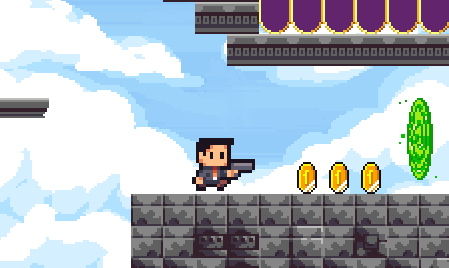
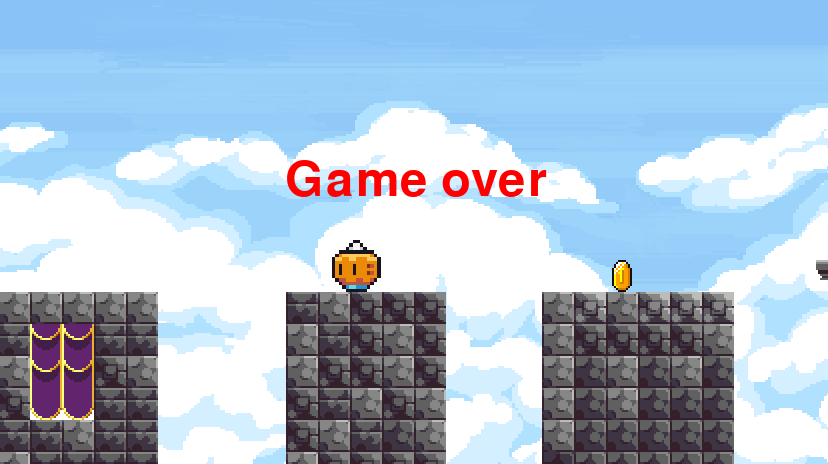

# Platformer

**Platformer** is a 2D platformer game written in Python using Pygame. The player controls a character that navigates through levels filled with obstacles, enemies, portals, and collectible items.

---

## Features

- Enemy behavior (crabs, pumpkins,soon...):
 .png)

- Portals for transitioning between areas:
  

- Sound effects for jumping, hitting, winning, and losing
- 

- Secret ways
- - .png)

-Soon...

## Requirements

- Python 3.8+
- pygame 2.0+
- PyTMX 3.32+

Installation:
pip install pygame

